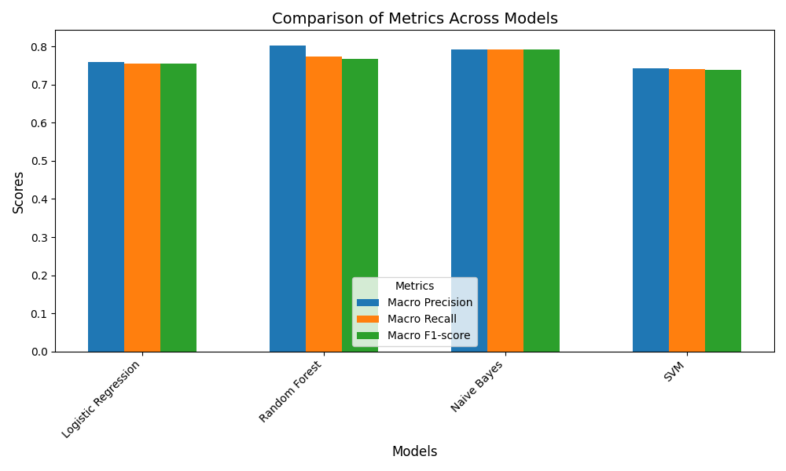

# Snorkel-based Weak Supervision for IMDb Movie Reviews

This project demonstrates how to **automatically label IMDb movie reviews** using **Snorkel**, a weak supervision framework. 

Instead of manually annotating thousands of reviews, we write **heuristic labeling functions** (LFs) — simple rules like "contains 'love'" or "has a negative sentiment" — and apply them using Snorkel. The system aggregates their outputs using **majority voting**, filters confident labels, and trains a logistic regression model to classify movie reviews as positive or negative.

---

## What is Snorkel?

**Snorkel** is an open-source Python library designed to reduce manual labeling effort by allowing you to:
- **Write labeling functions** (LFs) that heuristically assign labels.
- **Apply** them to unlabeled data using `PandasLFApplier`.
- **Combine** their outputs to estimate true labels (e.g., via `LabelModel` or majority vote).
- **Train models** on this weakly labeled data for downstream tasks.

We use Snorkel's `PandasLFApplier` and majority voting to generate labels and evaluate a model on the IMDb test set.

---

## Files

| File                          | Description                                                              |
|-------------------------------|--------------------------------------------------------------------------|
| `main.py`                     | Main pipeline — loads data, applies labeling functions, evaluates results. |
| `labeling.py`                 | Contains all labeling functions.                                        |
| `utils.py`                    | Helper functions for loading IMDb dataset.                              |
| `snorkel_annotated_reviews.csv` | Output file with weak labels and their responsible LFs.                  |

---

## Highlights

- Uses **Snorkel's** `PandasLFApplier` to apply LFs.
- Trains a **logistic regression**  and **random forest classifier** on weak labels.
- Evaluates model on the **IMDb test set**.
- Stores **labeled reviews** and the **LF responsible** in a CSV file.

---

## Example Output
              precision  recall       F1-score    support
       0       0.90      0.62            0.73      6017
       1       0.71      0.93            0.80      5983

      accuracy                           0.77      12000


---

## Setup Instructions

> **Important:** This project is compatible only with **Python 3.10.x**. Newer versions (like 3.12+) may break Snorkel or its dependencies.

### Using Conda (Recommended)

```bash
# Create and activate environment
conda create -n env python=3.10
conda activate env

# Install dependencies
pip install -r requirements.txt

#run the python file
python main.py
```

You will find the visualizations and the CSV file once you run the code. The visualizations look something like this.




You'll also find some confusion-matrices as well.

[project blog post on Medium](https://medium.com/@ravitejaravella8504/enhancing-movie-review-classification-with-snorkel-a-weak-supervision-approach-1e43846525fa).
